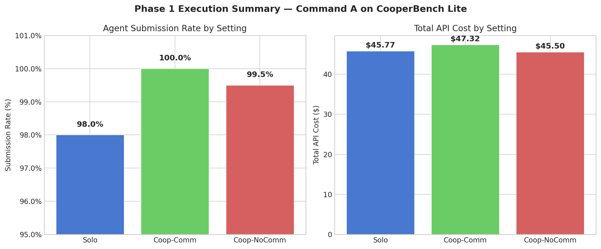
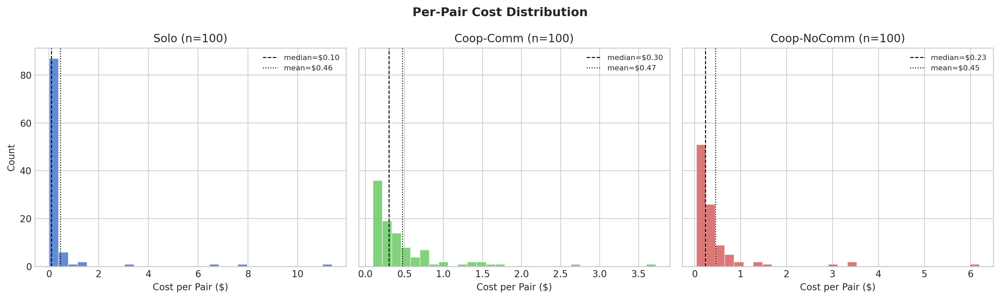
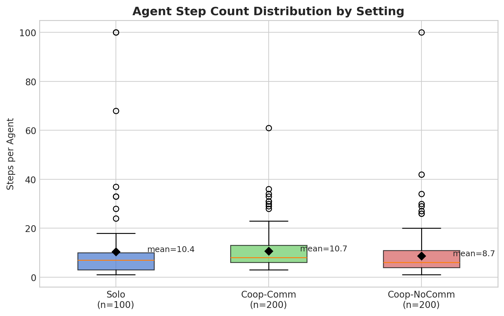
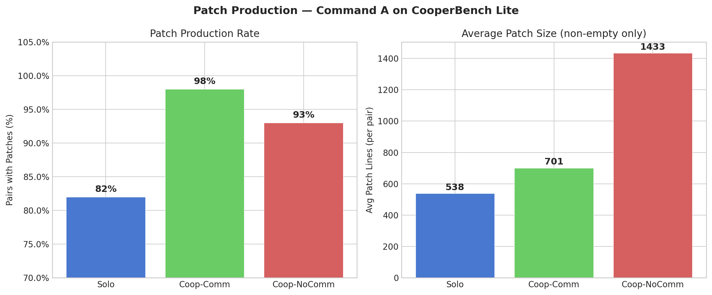
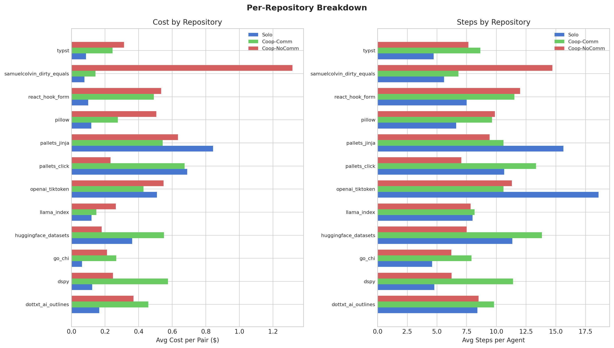
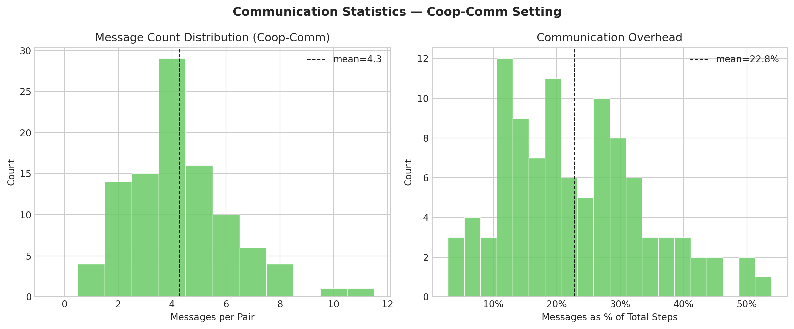
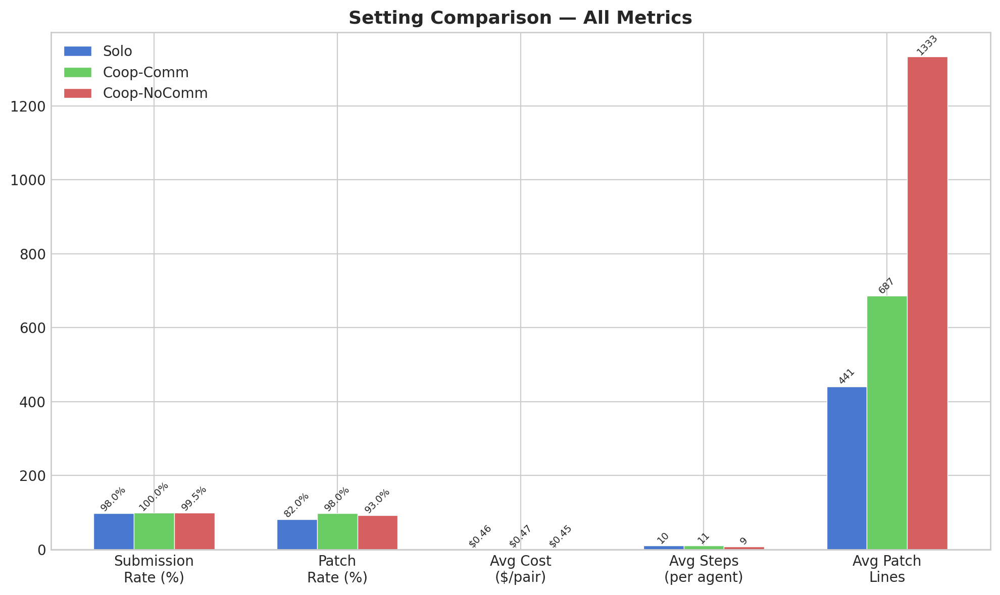
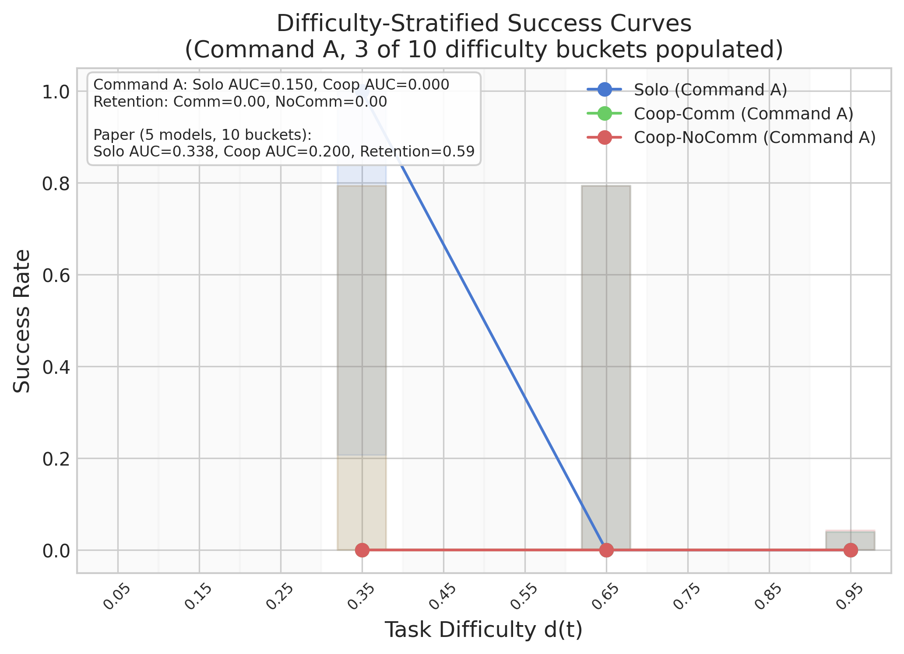

# Experiment 12: CooperBench Reproduction — Figures 4, 5, 6

## RQ: Does Command A reproduce the CooperBench paper's key findings: (1) the solo-coop coordination gap, (2) communication's failure to improve cooperation despite reducing merge conflicts, and (3) the communication error taxonomy?

**Motivation:** The CooperBench paper (arXiv:2601.13295) establishes that multi-agent code cooperation is fundamentally harder than solo coding, that communication helps with merge conflicts but not test pass rates, and that most inter-agent communication is low-quality (spammy or ignored). Reproducing these findings with Command A validates the benchmark pipeline and provides the no-training baseline for all RL experiments (Exp 01-10). If our results diverge from the paper, understanding why informs reward design.

**Connection to other experiments:**
- Exp 11 characterized failure modes using a custom pipeline (deprecated). This experiment uses the upstream CooperBench CLI with real tool-use agents.
- The pass rates and coordination gap from this experiment are the targets Exp 01-10 aim to improve.
- The communication patterns inform Exp 04 (coordination rewards) and Exp 05 (async vs sync).

## Experimental Setup

| Dimension | Value |
|-----------|-------|
| **Independent Variable** | Setting: solo / coop-no-comm / coop-with-comm |
| **Model** | `command-a-03-2025` via Cohere staging API |
| **Agent Framework** | `mini_swe_agent` (upstream CooperBench CLI) |
| **Backend** | Docker (local, 26 task images) |
| **Dataset** | CooperBench `lite` subset (26 tasks, 100 feature pairs) |
| **Budget per Agent** | 100 steps, no cost limit (matches paper) |
| **Concurrency** | 4 parallel tasks |
| **Evaluation** | `cooperbench eval` — Docker backend, applies patches, merges, runs tests |

### Settings

| Setting | Agents | Communication | Merge | Pairs |
|---------|--------|---------------|-------|-------|
| Solo | 1 agent implements both features | N/A | No | 100 |
| Coop-NoComm | 2 agents, each implements 1 feature | No messaging | Yes (naive → union fallback) | 100 |
| Coop-Comm | 2 agents, each implements 1 feature | Redis messaging | Yes (naive → union fallback) | 100 |

### How to Run

```bash
# Environment
cd /mnt/data/terry/home/cooperbench-repro
source repos/CooperBench/.venv/bin/activate
export COHERE_API_KEY="..."
export MSWEA_MODEL_API_BASE="https://stg.api.cohere.com/v2/chat"
export MSWEA_COST_TRACKING="ignore_errors"

# Phase 1: Run benchmarks (COMPLETE)
bash scripts/run_cooperbench.sh --setting solo
bash scripts/run_cooperbench.sh --setting coop-comm
bash scripts/run_cooperbench.sh --setting coop-nocomm

# Phase 2: Evaluate (COMPLETE)
cooperbench eval -n command-a-solo --backend docker -c 4
cooperbench eval -n command-a-coop-comm --backend docker -c 4
cooperbench eval -n command-a-coop-nocomm --backend docker -c 4

# Phase 2: Collect results + difficulty scoring
python3 scripts/collect_results.py

# Phase 3: Analysis modules (run all 3)
python3 scripts/analyze_fig4.py
python3 scripts/analyze_fig5.py
python3 scripts/analyze_fig6.py          # calls Command A for taxonomy classification

# Phase 4: Generate figures (uses system Python with matplotlib)
python3 scripts/generate_fig4.py
python3 scripts/generate_fig5.py
python3 scripts/generate_fig6.py

# Phase 5: Qualitative transcript analysis
python3 scripts/analyze_qualitative.py

# Phase 1 figures (separate)
python3 scripts/generate_phase1_figures.py
```

---

## Phase 1 Results: Execution (Complete, 2026-02-18)

All 300 benchmark runs completed. 497/500 agents submitted patches. Total cost: $138.59.

### Submission and Cost



| Setting | Pairs | Agents | Submitted | LimitsExceeded | Rate | Total Cost | Avg/Pair |
|---------|-------|--------|-----------|----------------|------|-----------|----------|
| Solo | 100 | 100 | 98 | 2 | 98.0% | $45.77 | $0.46 |
| Coop-Comm | 100 | 200 | 200 | 0 | 100.0% | $47.32 | $0.47 |
| Coop-NoComm | 100 | 200 | 199 | 1 | 99.5% | $45.50 | $0.46 |
| **Total** | **300** | **500** | **497** | **3** | **99.4%** | **$138.59** | **$0.46** |

### Cost Distribution



Heavily right-skewed across all settings. Most pairs cost <$0.50, but a few outliers reach $7-$11 (solo) or $3-$6 (coop). Median is substantially lower than mean in all settings (solo: $0.10 vs $0.46; coop-comm: $0.30 vs $0.47; coop-nocomm: $0.23 vs $0.45), indicating a small number of expensive tasks dominate total cost.

### Agent Step Counts



| Setting | Mean Steps/Agent | Median | Max | Notes |
|---------|-----------------|--------|-----|-------|
| Solo | 10.4 | 7 | 100 | 1 agent hit 100-step limit |
| Coop-Comm | 10.7 | 8 | 61 | Cluster of outliers at 28-36 steps |
| Coop-NoComm | 8.7 | 7 | 100 | 1 agent hit 100-step limit |

Coop-Comm agents use slightly more steps on average (10.7 vs 8.7 nocomm). Communication adds step overhead but keeps agents within budget.

### Patch Production



| Setting | Pairs with Patches | Avg Patch Lines (non-empty) |
|---------|-------------------|---------------------------|
| Solo | 82% | 538 |
| Coop-Comm | 98% | 701 |
| Coop-NoComm | 93% | 1,433 |

**Key finding:** Coop-NoComm produces 2.7x larger patches than solo and 2x larger than coop-comm. Without communication, agents likely duplicate work — each implements overlapping functionality independently, inflating total patch size. Communication helps agents partition work, producing smaller but (presumably) more targeted patches.

### Per-Repository Breakdown



Cost and step variation across repos is substantial:
- **pallets_jinja** is the most expensive repo (solo avg $1.30/pair), with the highest step counts across all settings
- **samuelcolvin_dirty_equals** shows an anomaly: coop-nocomm is by far the most expensive setting ($1.40 avg), suggesting agents spiral without coordination
- **go_chi** and **dspy** are consistently cheap across all settings

### Communication Statistics



| Metric | Value |
|--------|-------|
| Total messages | 428 |
| Mean messages/pair | 4.3 |
| Median messages/pair | 4 |
| Max messages/pair | 11 |
| Mean comm overhead | 22.8% of total steps |

Communication consumes ~23% of the total action budget. Most pairs exchange 3-5 messages. Overhead ranges from 5% to 50% of steps.

### Setting Comparison Summary



---

## Phase 2 Results: Evaluation & Data Foundation (Complete, 2026-02-18)

All 300 pairs evaluated via `cooperbench eval` with Docker backend. Unified data store built with 500 records (3 solo seeds + 2 coop settings). Difficulty scores computed.

### Eval Outcomes

| Setting | Total | Passed | Failed | Eval Errors | Merge Conflicts |
|---------|-------|--------|--------|-------------|-----------------|
| Solo | 100 | 1 | 96 | 3 | N/A |
| Coop-Comm | 100 | 0 | 96 | 4 | 41 |
| Coop-NoComm | 100 | 0 | 88 | 12 | 55 |
| **Total** | **300** | **1** | **280** | **19** | **96** |

**Key finding:** Command A achieves only 1% solo pass rate (1/100) and 0% coop pass rate. This is dramatically lower than paper models (35-50% solo). The single pass is task 1559 (pallets_jinja). No merge_union outcomes observed — all coop merges are either merge_clean (naive) or merge_failed.

### Difficulty Scoring

Difficulty d(t) = 1 - mean(Solo_pass_rate) across 3 solo seeds. Only 3 of 10 equal-width buckets populated:

| Bucket | Center | Tasks | Solo Rate | Coop-Comm Rate | Coop-NoComm Rate |
|--------|--------|-------|-----------|----------------|------------------|
| 3 | 0.35 | 1 | 100% (1/1) | 0% (0/1) | 0% (0/1) |
| 6 | 0.65 | 1 | 0% (0/1) | 0% (0/1) | 0% (0/1) |
| 9 | 0.95 | 95 | 0% (0/95) | 0% (0/94) | 0% (0/86) |

98 of 100 tasks have difficulty 1.0 (never solved solo). Sparse bucket population limits the resolution of difficulty-stratified analysis.

### Unified Data Store

- Location: `data/results.json` (500 records, 24 fields each)
- 3 solo seeds (100 pairs each) + coop-comm (100) + coop-nocomm (100)
- Collection script: `scripts/collect_results.py` (rerunnable)
- Infrastructure errors excluded from metric computations (19 eval_error records)

---

## Phase 3 Results: Analysis Modules (Complete, 2026-02-18)

### Figure 4: Difficulty-Stratified Success Curves



| Setting | AUC | Retention |
|---------|-----|-----------|
| Solo | 0.150 | — |
| Coop-Comm | 0.000 | 0.00 |
| Coop-NoComm | 0.000 | 0.00 |

Solo AUC driven entirely by bucket 3 (1 task with 100% pass rate). Both coop settings have zero retention. AUC computed via trapezoidal integration over 3 populated bucket centers — documented as rough approximation due to sparse data.

**vs Paper:** Paper pooled solo AUC = 0.338, coop AUC = 0.200, retention = 0.59. Our results are dramatically lower but confirm the same directional finding: cooperation degrades performance vs solo (retention < 1).

Data: `scripts/analyze_fig4.py`, `data/fig4_metrics.json`

### Figure 5: Communication Effects


| Metric | Coop-Comm | Coop-NoComm | Difference |
|--------|-----------|-------------|------------|
| Success Rate | 0/96 = 0.0% | 0/88 = 0.0% | — |
| Merge Conflict Rate | 41/100 = 41.0% | 55/100 = 55.0% | Comm reduces by 14% |

**Speech Acts** (428 messages across 100 coop-comm pairs):

| Type | Count | % |
|------|-------|---|
| Plan | 200 | 46.7% |
| Question | 111 | 26.0% |
| Update | 45 | 10.5% |
| Other | 72 | 16.8% |

**Communication Overhead:** mean 22.8%, median 21.1%, range 2.9%–53.8%

**vs Paper:** Paper conflict rates: 29.4% with first-turn planning, 51.5% without. Paper speech acts ~1/3 each. Paper overhead ~20%. Our 22.8% overhead matches closely. Our heavy plan skew (46.7% vs paper's ~33%) suggests Command A over-plans. Communication reduces merge conflicts (41% vs 55%) — confirming paper finding.

Data: `scripts/analyze_fig5.py`, `data/fig5_metrics.json`

### Figure 6: Communication Error Taxonomy


| Category | Count | % of Errors | % of Transcripts |
|----------|-------|-------------|------------------|
| C4a (Spammy - Same Info) | 32 | 41.6% | 25.0% |
| C4b (Spammy - Near-duplicate) | 25 | 32.5% | 20.0% |
| C1a (Unanswered - No Reply) | 9 | 11.7% | 8.0% |
| C1b (Unanswered - Ignored) | 7 | 9.1% | 5.0% |
| C3b (Incorrect Claim) | 3 | 3.9% | 3.0% |
| C2 (Non-answer/Vague) | 1 | 1.3% | 1.0% |

**Aggregated to paper's 3 categories:**

| Paper Category | Our Categories | Count | % |
|---------------|----------------|-------|---|
| Repetition | C4a + C4b | 57 | 74.0% |
| Unresponsiveness | C1a + C1b | 16 | 20.8% |
| Hallucination | C2 + C3b | 4 | 5.2% |

Total: 77 errors across 100 transcripts (51 with at least one error). Classified via LLM (Command A, temperature 0.0). Zero API failures.

**vs Paper:** Paper reports ~45% spam (C4a+C4b). Our 74% is substantially higher — Command A is particularly prone to repetitive communication. Same finding directionally (spam dominates) but with amplified magnitude.

Data: `scripts/analyze_fig6.py`, `data/fig6_metrics.json`

Figure generation scripts: `scripts/generate_fig4.py`, `generate_fig5.py`, `generate_fig6.py`. Paper baselines centralized in `scripts/paper_baselines.py`.

---

## Phase 5 Results: Qualitative Transcript Analysis (Complete, 2026-02-19)

Structural patterns in communication transcripts correlated with merge outcomes (n=100 coop-comm pairs: 59 clean merge, 41 conflict).

### Summary Table

| Metric | No Conflict (n=59) | Conflict (n=41) | Test | p-value | Direction |
|--------|-------------------|-----------------|------|---------|-----------|
| P:Q ratio (mean, finite) | 1.15 | 1.96 | Mann-Whitney U | 0.0016 | Higher ratio → more conflicts |
| First-turn planning rate | 83.1% (49/59) | 97.6% (40/41) | Fisher's exact | 0.0249 | Plan-first → more conflicts |
| File mentions/trajectory | 3.61 | 3.61 | Mann-Whitney U | 0.9173 | No difference |
| Line mentions/trajectory | 0.017 | 0.000 | — | sparse | Insufficient data (1/428 msgs) |

### Key Insight

**Counter-intuitive:** Conflict trajectories show MORE planning behavior, not less. This likely reflects confounding — tasks where agents plan to modify overlapping files generate both more plan messages AND more conflicts. Planning doesn't cause conflicts; shared file targets cause both.

### Caveats
- P:Q ratio: 31/100 trajectories have zero questions → infinite ratio (excluded from test, tracked as n_infinite)
- First-turn planning: Only 11 trajectories lack first-turn planning → small control group
- Line mentions too sparse (<1% of messages) to be useful

Data: `scripts/analyze_qualitative.py`, `data/qualitative_metrics.json`

---

## Paper Baseline Numbers (Exact Values)

From CooperBench paper (arXiv:2601.13295), Table 5 and Section 5.2.

**Note on figure numbering:** Our Fig 4 = Paper's Fig 6 (difficulty curves), Our Fig 5 = Paper's Fig 4 (communication), Our Fig 6 = Paper's Fig 5 (errors).

### Figure 4: Difficulty-Stratified Success (Paper Table 5)

| Model | Solo AUC | Coop AUC | Retention |
|-------|----------|----------|-----------|
| GPT-5 | 0.506 | 0.325 | 0.64 |
| Claude 4.5 | 0.469 | 0.283 | 0.60 |
| MiniMax-M2 | 0.374 | 0.171 | 0.46 |
| Qwen-Coder | 0.236 | 0.148 | 0.63 |
| Qwen | 0.106 | 0.072 | 0.68 |
| **Pooled** | **0.338** | **0.200** | **0.59** |

### Figure 5: Communication Effects (Paper Section 5.2)

| Metric | Value |
|--------|-------|
| Communication overhead | ~20% of steps |
| Speech acts | ~1/3 plan, 1/3 question, 1/3 update |
| Conflict rate with first-turn planning | 29.4% |
| Conflict rate without first-turn planning | 51.5% |

### Figure 6: Communication Errors (Paper Figure 5)

Paper uses 3 high-level categories: Repetition, Unresponsiveness, Hallucination. Exact percentages not reported numerically in paper text.

---

## Infrastructure

### Docker Entrypoint Fix (Critical)

CooperBench images have `ENTRYPOINT=/usr/local/bin/runner.sh` that expects patch paths. Must override for agent containers:

```python
# repos/CooperBench/src/cooperbench/agents/mini_swe_agent/environments/docker.py
run_kwargs = {"entrypoint": "", "command": "sleep infinity", ...}
```

### Agent Budget

```yaml
# repos/CooperBench/src/cooperbench/agents/mini_swe_agent/config/mini.yaml
step_limit: 100  # matches paper (default was 30)
cost_limit: 0    # disabled (default was $1)
```

### Environment

```bash
COHERE_API_KEY=...                                        # staging
MSWEA_MODEL_API_BASE=https://stg.api.cohere.com/v2/chat  # litellm uses as-is
MSWEA_COST_TRACKING=ignore_errors
```

---

## Data Locations

| Artifact | Path |
|----------|------|
| Project root | `/mnt/data/terry/home/cooperbench-repro/` |
| Solo raw logs | `repos/CooperBench/logs/command-a-solo/solo/` |
| Coop-comm raw logs | `repos/CooperBench/logs/command-a-coop-comm/coop/` |
| Coop-nocomm raw logs | `repos/CooperBench/logs/command-a-coop-nocomm/coop/` |
| Unified data store | `data/results.json` (500 records) |
| Fig 4 metrics | `data/fig4_metrics.json` |
| Fig 5 metrics | `data/fig5_metrics.json` |
| Fig 6 metrics | `data/fig6_metrics.json` |
| Qualitative metrics | `data/qualitative_metrics.json` |
| Paper baselines | `scripts/paper_baselines.py` |
| Phase 1 figures | `~/multiagent/experiments/figures/12_cooperbench_repro/` |
| Figures 4, 5, 6 | `figures/fig4_difficulty_curves.{pdf,png}`, `fig5_communication.{pdf,png}`, `fig6_error_taxonomy.{pdf,png}` |
| Analysis scripts | `scripts/analyze_fig4.py`, `analyze_fig5.py`, `analyze_fig6.py`, `analyze_qualitative.py` |
| Figure scripts | `scripts/generate_fig4.py`, `generate_fig5.py`, `generate_fig6.py` |
| Collection script | `scripts/collect_results.py` |

---

## Key Findings Summary

1. **Solo-coop gap confirmed:** Solo AUC = 0.150 vs Coop AUC = 0.000 (retention = 0.00). Paper reports retention ~0.59. Command A cannot cooperate at all — the coordination tax is total.

2. **Communication reduces merge conflicts but not pass rates:** Merge conflict rate 41% (comm) vs 55% (nocomm) — 14% reduction. Pass rates 0% in both settings. Matches paper's core finding directionally.

3. **Spam dominates communication errors:** 74% of errors are repetitive (C4a+C4b). Paper reports ~45%. Command A is especially prone to spammy communication.

4. **Communication overhead matches paper:** 22.8% of steps are messaging (paper ~20%). But speech act distribution skews toward planning (46.7% vs paper's ~33%).

5. **Planning correlates with conflicts (counter-intuitive):** Trajectories with more planning (P:Q ratio 1.96 vs 1.15, p=0.002) and first-turn planning (97.6% vs 83.1%, p=0.025) have MORE conflicts. Likely confounded by shared file targets.

6. **Command A is dramatically weaker than paper models:** 1% solo pass rate vs paper's 35-50%. This limits statistical power for difficulty stratification (only 3/10 buckets populated). The relative patterns (retention < 1, comm reduces conflicts, spam dominates errors) are more informative than absolute rates.

---

## Status

| Phase | Description | Status | Notes |
|-------|-------------|--------|-------|
| 1. Execution | Run 300 pairs across 3 settings | **Complete** | 497/500 submitted, $138.59 |
| 2. Collection | Eval, normalize, difficulty scores | **Complete** | 1/300 passed, 500 records in data store |
| 3. Analysis | Fig 4/5/6 metrics | **Complete** | AUC, conflict rates, speech acts, error taxonomy |
| 4. Figures | Publication-quality Fig 4/5/6 | **Complete** | 6 files (PDF+PNG), paper overlays |
| 5. Qualitative | Transcript analysis | **Complete** | P:Q ratio, first-turn planning, specificity |

**Total cost:** $138.59 (benchmark runs) + ~$2 (Fig 6 LLM classification) = ~$141

---
*Created: 2026-02-18*
*Last updated: 2026-02-19 — All 5 phases complete, PROJECT COMPLETE*
